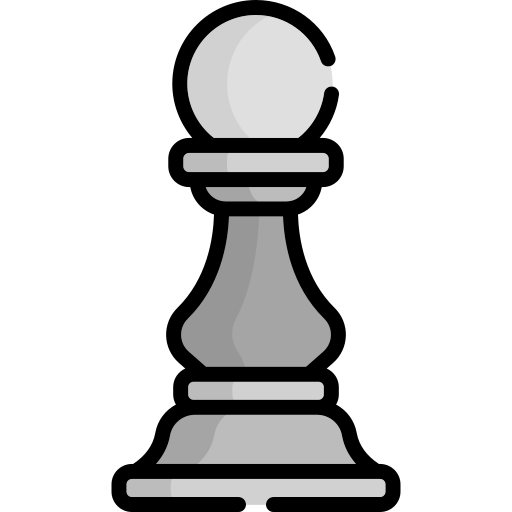

# GitHub README Chess Tournament

Hello, my name is Rico and love CICD pipeline, IaC and Kubernetes.

If you pass here, why don't you play a little game? 😆

This is an open chess tournament where ANYONE can play. That's the fun part.  
It's your turn to play! Move a <!-- BEGIN TURN -->black<!-- END TURN --> piece.

<!-- BEGIN CHESS BOARD -->
|   | A | B | C | D | E | F | G | H |   |
|---|:-:|:-:|:-:|:-:|:-:|:-:|:-:|:-:|:-:|
| **8** |  |  |  |  |  |  |  |  | **8** |
| **7** |  |  |  |  |  |  |  |  | **7** |
| **6** |  |  |  |  |  |  |  |  | **6** |
| **5** |  |  |  |  |  |  |  |  | **5** |
| **4** |  |  |  |  |  |  |  |  | **4** |
| **3** |  |  |  |  |  |  |  |  | **3** |
| **2** |  |  |  |  |  |  |  |  | **2** |
| **1** |  |  |  |  |  |  |  |  | **1** |
|   | **A** | **B** | **C** | **D** | **E** | **F** | **G** | **H** |   |
<!-- END CHESS BOARD -->

**It's your turn to move! Choose one from the following table**
<!-- BEGIN MOVES LIST -->
**CHECK!** Choose your move wisely!
|  FROM  | TO (Just click a link!) |
| :----: | :---------------------- |
| **B8** | [C6](https://github.com/RicoToothless/RicoToothless/issues/new?title=Chess%3A+Move+B8+to+C6&body=Please+do+not+change+the+title.+Just+click+%22Submit+new+issue%22.+You+don%27t+need+to+do+anything+else+%3AD), [D7](https://github.com/RicoToothless/RicoToothless/issues/new?title=Chess%3A+Move+B8+to+D7&body=Please+do+not+change+the+title.+Just+click+%22Submit+new+issue%22.+You+don%27t+need+to+do+anything+else+%3AD) |
| **C7** | [C6](https://github.com/RicoToothless/RicoToothless/issues/new?title=Chess%3A+Move+C7+to+C6&body=Please+do+not+change+the+title.+Just+click+%22Submit+new+issue%22.+You+don%27t+need+to+do+anything+else+%3AD) |
| **D8** | [D7](https://github.com/RicoToothless/RicoToothless/issues/new?title=Chess%3A+Move+D8+to+D7&body=Please+do+not+change+the+title.+Just+click+%22Submit+new+issue%22.+You+don%27t+need+to+do+anything+else+%3AD) |
| **F6** | [D7](https://github.com/RicoToothless/RicoToothless/issues/new?title=Chess%3A+Move+F6+to+D7&body=Please+do+not+change+the+title.+Just+click+%22Submit+new+issue%22.+You+don%27t+need+to+do+anything+else+%3AD) |
<!-- END MOVES LIST -->

Having fun? Ask a friend to do the next move!

#### How it works

When you click on a link and submit a new issue with the desired move, a GitHub action is triggered, which in turn runs a small python script that performs the specified movement, updates this README file and commits the changes.

Have you spotted a bug? Something missing? Feel free to open an [issue](https://github.com/marcizhu/readme-chess/issues) and I will try to fix it as soon as possible :D

  
Last 5 moves in this game

<!-- BEGIN LAST MOVES -->

| Move | Author |
| :--: | :----- |
| `F1` to `B5` | [ @TobTobXX](https://github.com/TobTobXX) |
| `G7` to `G6` | [ @justincremer](https://github.com/justincremer) |
| `G2` to `F3` | [ @dannypsnl](https://github.com/dannypsnl) |
| `G4` to `F3` | [ @justincremer](https://github.com/justincremer) |
| `B1` to `C3` | [ @jollyga](https://github.com/jollyga) |

<!-- END LAST MOVES -->

  
Top 10 most moves across all games

<!-- BEGIN TOP MOVES -->

| Total moves |  User  |
| :---------: | :----- |
| 5 | [@justincremer](https://github.com/justincremer) |
| 1 | [@marcizhu](https://github.com/marcizhu) |
| 1 | [@miztiik](https://github.com/miztiik) |
| 1 | [@Filius-Patris](https://github.com/Filius-Patris) |
| 1 | [@jollyga](https://github.com/jollyga) |
| 1 | [@dannypsnl](https://github.com/dannypsnl) |
| 1 | [@TobTobXX](https://github.com/TobTobXX) |

<!-- END TOP MOVES -->

